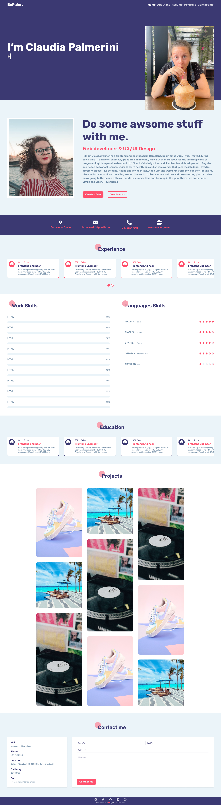
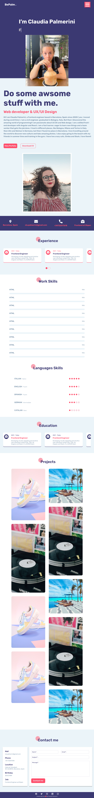
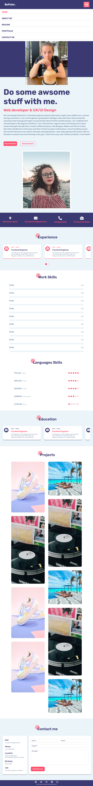

# Project 4 - CV single page with VITE and JS

## Acceptance criteria

- [x] Responsive / Good semantics / CSS variables
- [x] Code divided into components, with its JavaScript (js) and CSS respectively
- [x] Minimum 2 functionalities with events
- [x] Data rendering using variables (do not input data directly into the elements we create)
- [x] Do not create any element within the body of the HTML that is not already created by default in VITE

## Implementation:

- The project is a single page CV with different section, about me, infos, work experiences, skills, education, projects and contact me
- It is done with VITE and vanilla JS
- It is done using reusable component in JS
- The web is fully responsive

## Figma design

### Desktop

### Tablet 

### Mobile

